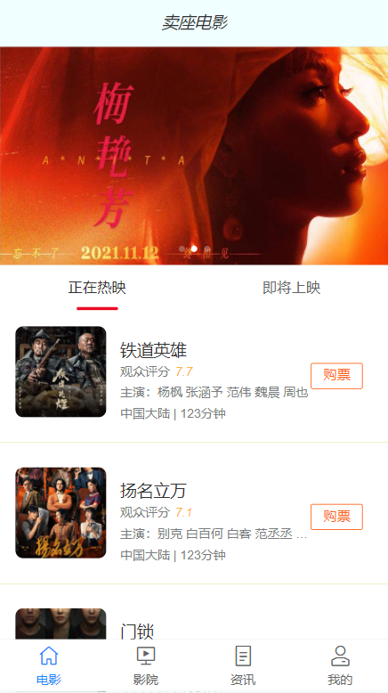
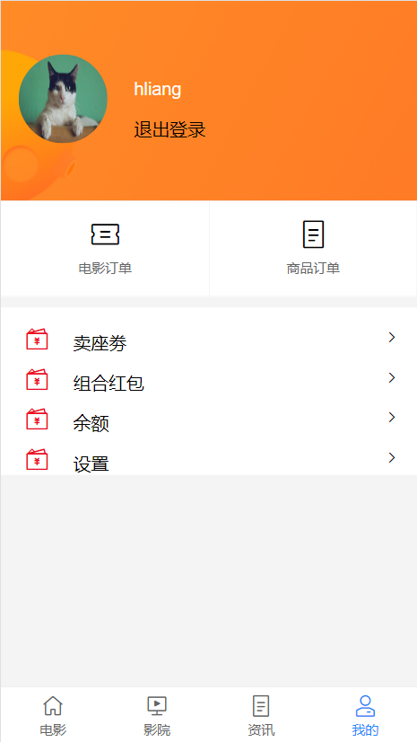
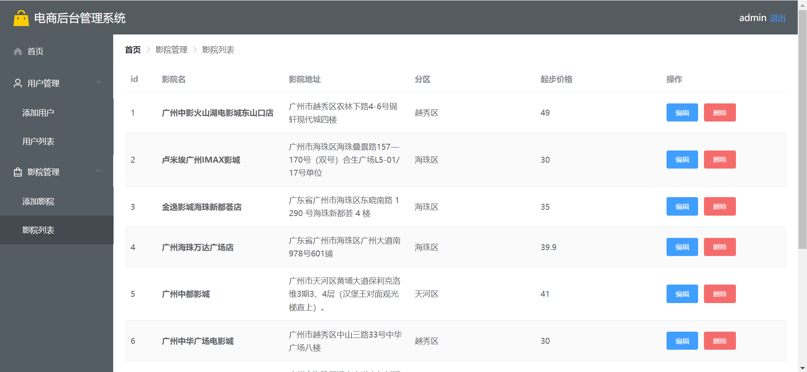
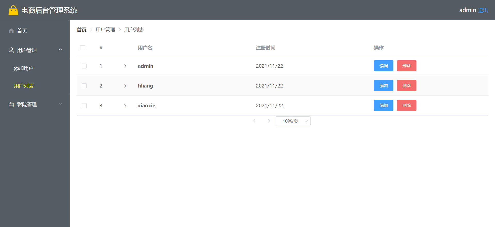

# Vue项目：卖座电影

## 演示
* 官网：https://m.maizuo.com/v5/#/films/nowPlaying
* webApp：120.78.229.74:8080
* 后台管理系统：120.78.229.74:8081
    * 测试账号
        * 账号：admin
        * 密码：123456
* git仓库地址：git@github.com:gzh52108/MiaoMovice.git

## 团队与分工
* 负责人：谢文杰，团队成员：付海良，肖怀松
* 负责模块说明
    * 谢文杰
        1. 完成webApp首页和影院页面和对应接口
        2. 完成后台管理系统的影院管理和对应接口
    * 付海良
        1. 爬取数据和编写用户CRUD接口
        2. 完成电影详情页和购票页
        3. 完善首页和资讯页
    * 肖怀松
        1. 完成webApp用户登录和注册和对应接口
        2. 利用接口完成后台管理系统的用户管理

## 项目页面截图
<!-- 

 -->

&nbsp;&nbsp;&nbsp;&nbsp;&nbsp;&nbsp; &nbsp;&nbsp;&nbsp;&nbsp;&nbsp;&nbsp;    

 

 
